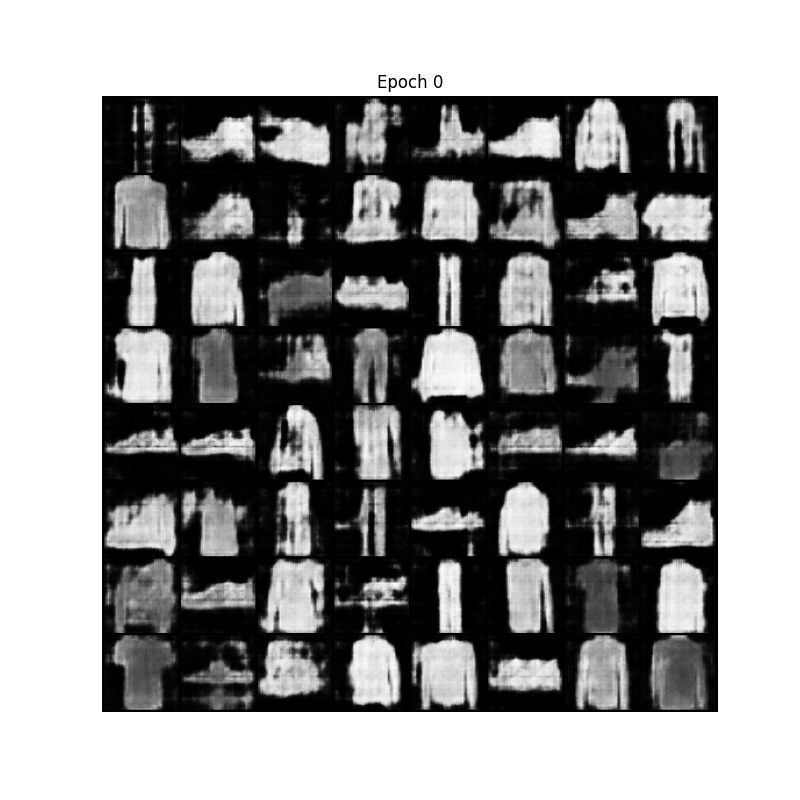
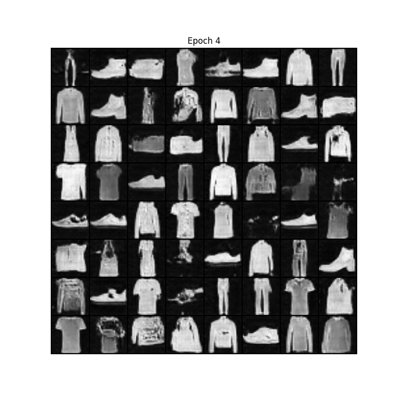
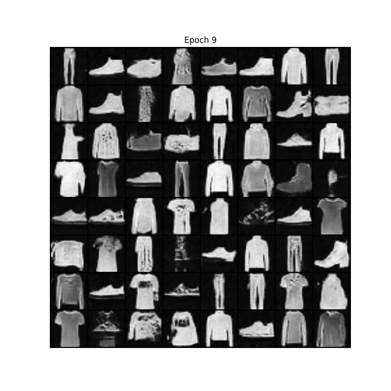
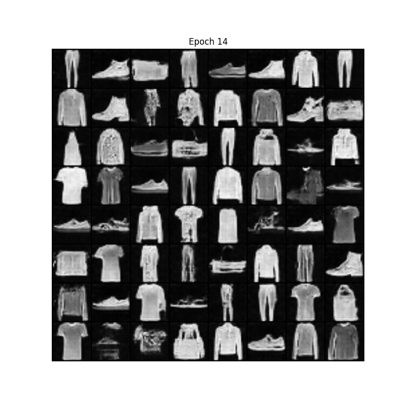
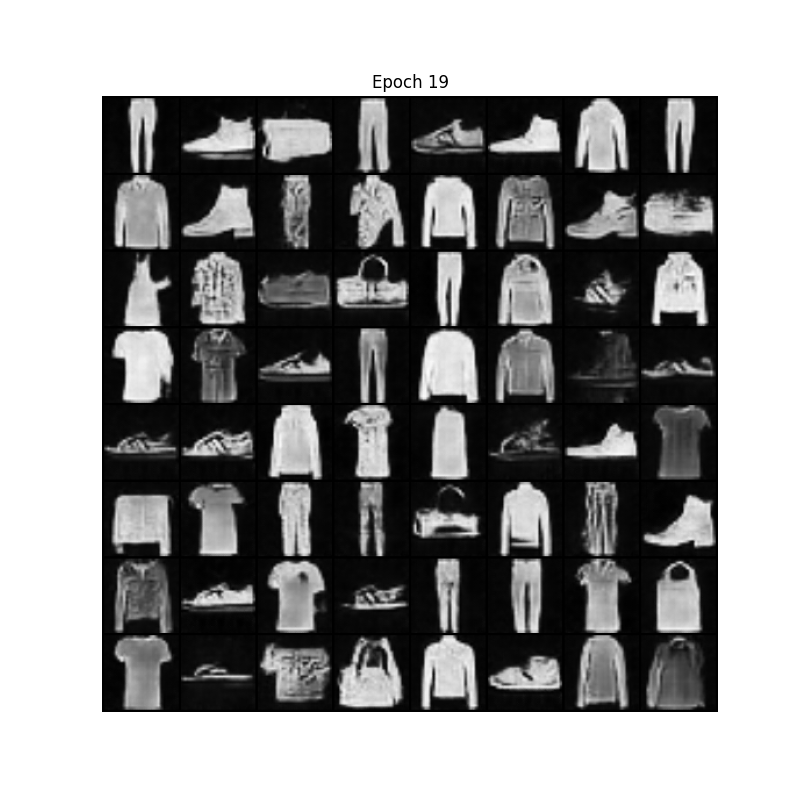
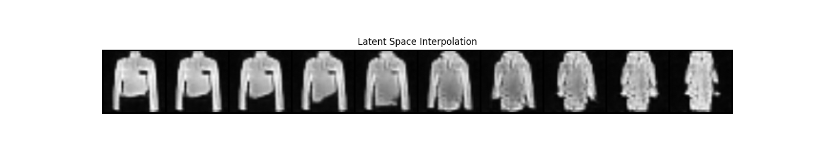
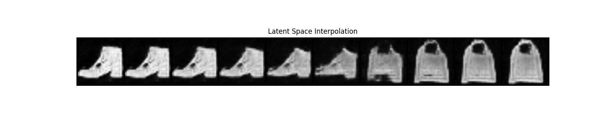

# Fashion-MNIST DCGAN Implementation

This repository contains an implementation of a Deep Convolutional Generative Adversarial Network (DCGAN) trained on the Fashion-MNIST dataset. The implementation is built using PyTorch and features a modular design for easy experimentation.

## Project Structure

- **main.py**: Training loop and execution entry point
- **config.py**: Configuration parameters and hyperparameters
- **models.py**: Generator and Discriminator network definitions
- **data.py**: Data loading and preprocessing utilities
- **utils.py**: Helper functions for image generation and visualization
- **results/**: Generated images with NGF/NDF = 64 (higher capacity model)
- **results1/**: Generated images with NGF/NDF = 32 (lower capacity model)

## DCGAN Architecture

The Deep Convolutional GAN architecture used in this project follows the guidelines from the original DCGAN paper:

- **Generator**: Takes random noise and transforms it into an image through a series of transposed convolutions.
- **Discriminator**: Takes an image and determines whether it's real or fake through a series of convolutional layers.

Key architectural features:
- Convolutional layers instead of fully connected layers
- Batch normalization for stable training
- ReLU activation in generator (except for output layer using Tanh)
- LeakyReLU activation in discriminator
- Adam optimizer with tuned hyperparameters

## Results

### Feature Map Size Comparison

Two versions of the model were trained with different numbers of feature maps:

**Higher Capacity Model (NGF/NDF = 64)**
- Located in the `results/` directory
- More feature maps allow the model to learn more complex patterns
- Generates higher quality fashion items with more detailed features
- Takes longer to train and requires more memory

**Lower Capacity Model (NGF/NDF = 32)**
- Located in the `results1/` directory
- Fewer feature maps result in a smaller, faster model
- Generates slightly less detailed fashion items
- More efficient training and lower memory requirements

### Loss Curves

The repository includes loss curve plots showing the training dynamics:
- Generator loss tends to increase initially as the discriminator improves
- Discriminator loss decreases as it learns to distinguish real and fake images
- As training progresses, both losses should stabilize when the networks reach equilibrium

### Latent Space Interpolation

The latent space interpolation demonstrates the model's ability to generate meaningful transitions between different fashion items. By linearly interpolating between two random points in the latent space, we can:
- Observe smooth transitions between different fashion concepts
- Verify that the model has learned a continuous representation of the data
- Detect potential mode collapse if transitions appear discontinuous

## Principles

DCGAN works by training two networks in an adversarial setting:

1. **Generator Network**: Tries to create fake images that look indistinguishable from real ones
2. **Discriminator Network**: Tries to distinguish between real images from the dataset and fake images produced by the Generator

During training:
- The Discriminator is trained to maximize the probability of correctly classifying real and fake images
- The Generator is trained to maximize the probability of the Discriminator making a mistake

This adversarial process encourages the Generator to produce increasingly realistic fashion images over time.

## Generated Samples

Check the `results/` and `results1/` directories for:
- Images showing training progression across epochs
- Grid visualizations of generated fashion items
    

    
    
    
    
    
  

- Latent space interpolation demonstrations
   

    
    
  
  

## References

- Radford, A., Metz, L., & Chintala, S. (2015). [Unsupervised representation learning with deep convolutional generative adversarial networks](https://arxiv.org/abs/1511.06434). arXiv preprint arXiv:1511.06434.
- Xiao, H., Rasul, K., & Vollgraf, R. (2017). [Fashion-MNIST: a Novel Image Dataset for Benchmarking Machine Learning Algorithms](https://arxiv.org/abs/1708.07747). arXiv preprint arXiv:1708.07747.
